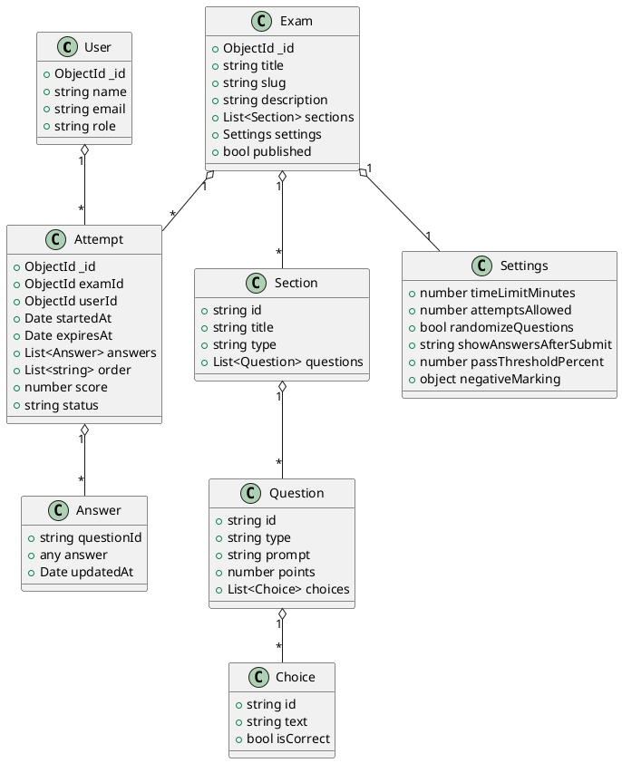

Use cases cho User và Admin

Phần này mô tả các tác nhân chính (User, Admin), các use case quan trọng, điều kiện tiền đề (preconditions), luồng chính (happy path) và luồng thay thế (edge cases).

1) Tác nhân
- User: người dùng cuối (có thể đã đăng nhập hoặc anonymous) tham gia làm đề, xem kết quả.
- Admin: người quản trị nội dung (có quyền tạo/sửa/xóa đề, quản lý câu hỏi và xuất bản).

2) Use cases cho User

UC-1: Xem danh sách đề thi
- Preconditions: none (các đề public mới hiển thị)
- Main flow:
  1. User mở trang danh sách đề (/exams)
  2. Hệ thống trả về danh sách các đề public (title, short description, timeLimit, attemptsAllowed)
  3. User chọn 1 đề để xem chi tiết
- Alternate flows:
  - Nếu không có đề phù hợp, hiển thị thông báo "Không tìm thấy đề"

UC-2: Xem chi tiết đề thi
- Preconditions: exam.published = true
- Main flow:
  1. User mở trang chi tiết (/exams/:id)
  2. Hệ thống hiển thị thông tin (title, description, cấu trúc, time limit, attempts left nếu đăng nhập)
  3. User có thể nhấn "Bắt đầu" để khởi tạo attempt
- Alternate flows:
  - Nếu user chưa đăng nhập và hệ thống yêu cầu đăng nhập để theo dõi attempts, hiển thị prompt đăng nhập

UC-3: Bắt đầu làm bài (Start)
- Preconditions: exam published && attempts left > 0 (nếu giới hạn)
- Main flow:
  1. User nhấn "Bắt đầu"
  2. Client gọi POST /exams/:id/start
  3. Server kiểm tra attemptsAllowed, tạo Attempt, trả về attemptId và expiresAt
  4. Client chuyển sang trang làm bài với attemptId
- Alternate flows:
  - Nếu attempts hết, server trả 400 và client hiển thị thông báo
  - Nếu có lỗi server trả 500 => hiển thị toast lỗi

UC-4: Làm bài (in-progress)
- Preconditions: Attempt đang ở trạng thái 'in_progress'
- Main flow:
  1. Client tải cấu trúc đề theo attempt (order nếu có)
  2. User trả lời câu hỏi, client autosave định kỳ lên POST /exams/:id/attempts/:attemptId/save
  3. User nhấn "Nộp" hoặc thời gian hết -> client gọi POST /exams/:id/attempts/:attemptId/submit
  4. Server chấm (auto) và trả kết quả; client hiển thị màn kết quả/review
- Alternate flows:
  - Nếu attempt expired, server trả lỗi khi save/submit => client hiển thị thông báo và chuyển sang chế độ read-only
  - Nếu mạng mất, client giữ offline và retry khi online

3) Use cases cho Admin

UC-A1: Tạo đề mới
- Preconditions: admin đã xác thực
- Main flow:
  1. Admin mở giao diện tạo đề
  2. Điền title, description, sections (JSON hoặc form), settings
  3. Admin lưu -> Server tạo Exam và trả examId
- Alternate: Validate lỗi, hiển thị field-level errors

UC-A2: Sửa đề / quản lý câu hỏi
- Preconditions: admin đã xác thực
- Main flow:
  1. Admin mở trang edit đề
  2. Thêm/sửa/xóa câu hỏi trong section
  3. Lưu -> server validate và cập nhật
- Alternate: version conflict -> server trả 409

UC-A3: Publish / Unpublish
- Preconditions: admin đã xác thực và đề có ít nhất 1 câu hỏi
- Main flow:
  1. Admin bấm Publish
  2. Server kiểm tra precondition (hasQuestions) và set published = true

---

Biểu đồ lớp (PlantUML)

Dưới đây là sơ đồ lớp bằng PlantUML cho các thực thể chính. Bạn có thể paste phần PlantUML vào một công cụ render (vscode PlantUML extension hoặc plantuml.com) để xem hình.

Ghi chú
- Nếu bạn muốn mình render trực tiếp file UML thành hình, mình có thể tạo file `.puml` trong `docs/` hoặc đưa ảnh SVG/PNG vào repo (nếu cần).